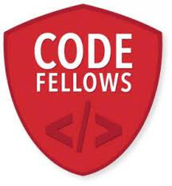

# my-notes
## Introduction about my self.
I'm **sedra**, I'm 21 years old. I'm syrian.
I'm a software engineer student in ASAC.
I attend code fellows course to improve and gain new skills.

## A good developer mindset .
1. Conceiving The Purpose of Software.
2. The Goals of Software Design.

**Every programmer is a designer.❤️**

3. (Mis)understanding.

**Understanding is the key difference between a bad developer and a good developer.😊👍**

4. Good enough is fine.

**“Perfect is the enemy of good.”**